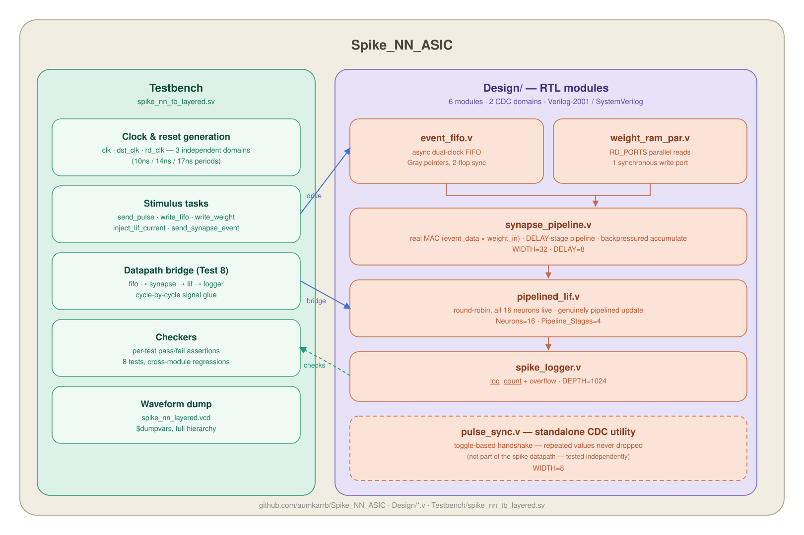
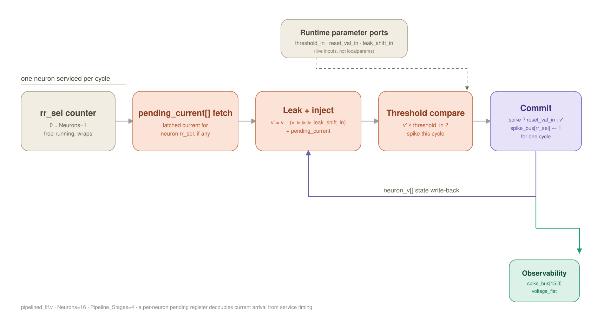
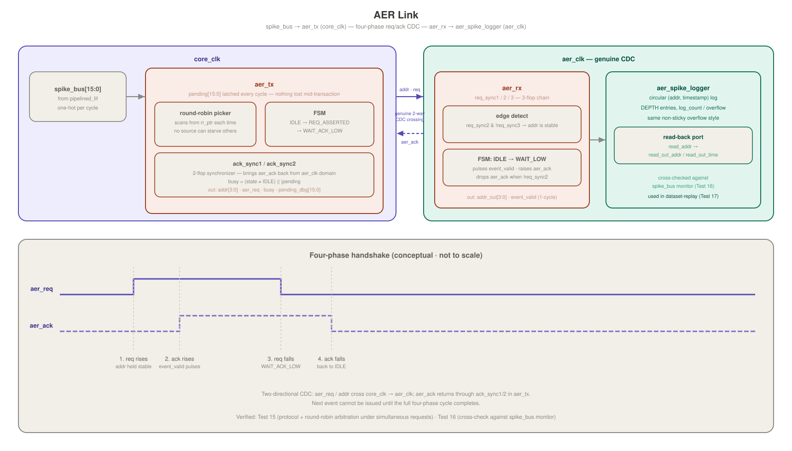

# Spike NN ASIC — Digital Spiking Neural Network for ASIC Implementation

> RTL design and verification of a pipelined, multi-neuron, asynchronous leaky integrate-and-fire spiking neural network core in Verilog, with a four-phase AER output link


---

## Overview

Spike_NN_ASIC implements the core datapath of a digital spiking neural network — event ingestion, synaptic weighting, leaky integrate-and-fire neuron dynamics, and spike-event output — as nine standalone Verilog modules spanning three genuinely independent clock domains. The FIFO ingests events, the synapse pipeline weighs them, the sixteen-neuron array integrates them, and the AER link carries spikes back. All are separately-clocked RTL, wired together with, a downstream integrator.

An incoming event — a synaptic weight address paired with an activation magnitude — crosses from a host-side write clock into the core clock through a Gray-coded, dual-port FIFO, is resolved against a parallel-read weight RAM, multiply-accumulated into a post-synaptic current, and injected into whichever of sixteen neurons a round-robin scheduler happens to be servicing that cycle. Each neuron's membrane potential leaks, integrates, and — through a saturating rather than wrapping adder — either settles below threshold or spikes and resets. Every spike is counted locally and, independently, carried off the neuron array entirely: a four-phase request/acknowledge handshake transports it across a third, independently-clocked domain into its own address-event log, complete with a read-back port for offline comparison against reference datasets.

## Repository Structure

```
Spike_NN_ASIC/
├── Design/
│   ├── event_fifo.v                   # Asynchronous (dual-clock) AER-style event-input FIFO
│   ├── weight_ram_par.v               # Parallel-access weight RAM (synapse memory)
│   ├── synapse_pipeline.v             # Pipelined synaptic multiply-accumulate unit
│   ├── pipelined_lif.v                # Round-robin pipelined, multi-neuron LIF array
│   ├── spike_logger.v                 # Simple any-neuron spike counter / monitor
│   ├── aer_tx.v                       # AER transmitter: round-robin arbiter, 4-phase req/ack
│   ├── aer_rx.v                       # AER receiver: CDC into aer_clk, 4-phase req/ack
│   ├── aer_spike_logger.v             # AER-side event log with (addr, timestamp) read-back
│   └── pulse_sync.v                   # Toggle-based CDC pulse synchronizer (standalone utility)
│
├── docs/
│   ├── spike_nn_asic_top_level_architecture.svg   # Conceptual system architecture, all 3 clock domains
│   ├── pipelined_lif_datapath.svg                 # pipelined_lif.v internal datapath diagram
│   └── aer_link_datapath.svg                      # AER 4-phase link datapath + handshake timing
│
├── References/                        # 8 background papers: SNNs, AER, Loihi, neuromorphic HW
│
├── Reports/
│   ├── Icarus_Verilog_Log.txt         # Full simulation log: all 17 tests / 34 checks, PASS/FAIL
│   ├── Waveform_Part1.png             # Waveform capture
│   ├── Waveform_Part2.png             # Waveform capture
│   └── Waveform_Part3.png             # Waveform capture
│
├── Testbench/
│   ├── spike_nn_tb_layered.sv         # Layered SystemVerilog testbench, 17 tests
│   └── synthetic_spike_dataset.txt    # 16-channel, 315-event dataset for the replay test
│
├── LICENSE                            # License file
└── README.md                          # This file
```

---

## Module Reference



There is no single top-level RTL file in this repository — no integration shim, no synthesis wrapper. **"Spike-NN Core"** in the diagram above is a conceptual boundary, not a file: 

---

## Pipelined LIF Datapath




---

## AER Link




---

## Testbench

`Testbench/spike_nn_tb_layered.sv` instantiates all nine RTL modules directly — including four independent clock domains (`clk`/`dst_clk`/`rd_clk`/`aer_clk`, at 10ns/14ns/17ns/21ns periods respectively, to genuinely exercise every CDC path at unrelated frequencies) — and runs 17 tests in sequence, for 34 individual pass/fail checks total (see `Reports/Icarus_Verilog_Log.txt` for the full log — all 34 currently pass).

| Test | What it checks |
|---|---|
| 1. Pulse Synchronization | True CDC across `src_clk`/`dst_clk`; explicit regression for the repeated-identical-value case |
| 2. FIFO Operation | Data written on `wr_clk` correctly crosses into the `rd_clk` domain and drains back to empty |
| 3. Weight RAM Access | All `RD_PORTS` read lanes return correct, independent data in parallel, same cycle |
| 4. Synapse Pipeline | Real MAC output value, accumulated correctly across multiple synaptic events, honoring backpressure |
| 5. LIF Neuron (neuron 0) | Gradual leaky-integrate accumulation across repeated sub-threshold injections correctly reaches threshold and spikes |
| 6. Spike Logger | Baseline counting/timestamping behavior |
| 7. Multi-Neuron Array | Five distinct neurons (0, 3, 7, 11, 15) targeted individually and confirmed to spike independently via `spike_bus` |
| 8. Full Datapath Integration | `event_fifo → synapse_pipeline → pipelined_lif → spike_logger` wired together and verified end-to-end |
| 9. Spike Logger Capacity & Overflow | Logger reaches full `LOG_DEPTH` with no premature overflow; overflow pulses on the over-capacity attempt and self-clears — not a sticky latch |
| 10. LIF Same-Cycle Injection Race | An injection into the neuron currently being serviced this same cycle is not dropped |
| 11. Synapse Zero-Sum Accumulation | A backlog that sums to exactly zero still produces a real output beat rather than being treated as empty |
| 12. LIF Saturation | A combined sum that would overflow a naive 16-bit add saturates correctly instead of wrapping |
| 13. FIFO Full Backpressure | `fifo_full` correctly rejects over-capacity writes and the FIFO recovers cleanly after draining |
| 14. Weight RAM Read/Write Collision | Same-cycle read/write returns old data during the write and new data after |
| 15. AER Link Protocol & Arbitration | Single-event handshake and simultaneous multi-source requests are both correctly arbitrated and delivered, none lost |
| 16. AER Integration & Cross-Check | Real `spike_bus → AER → aer_spike_logger` traffic; AER log total matches an independent `spike_bus` monitor |
| 17. Dataset Replay | 315-event synthetic dataset replayed through the full chain; elevated-rate "hot" channels show correspondingly elevated output activity |

A 2 ms simulation timeout guards against hangs, and `$dumpvars` writes a VCD for waveform inspection in GTKWave or similar tools; `Reports/Waveform_Part1-3.png` are screenshots from that capture.

---

## License

MIT License — see `LICENSE`.
